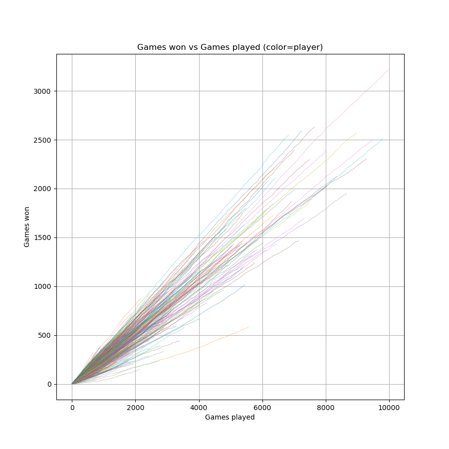
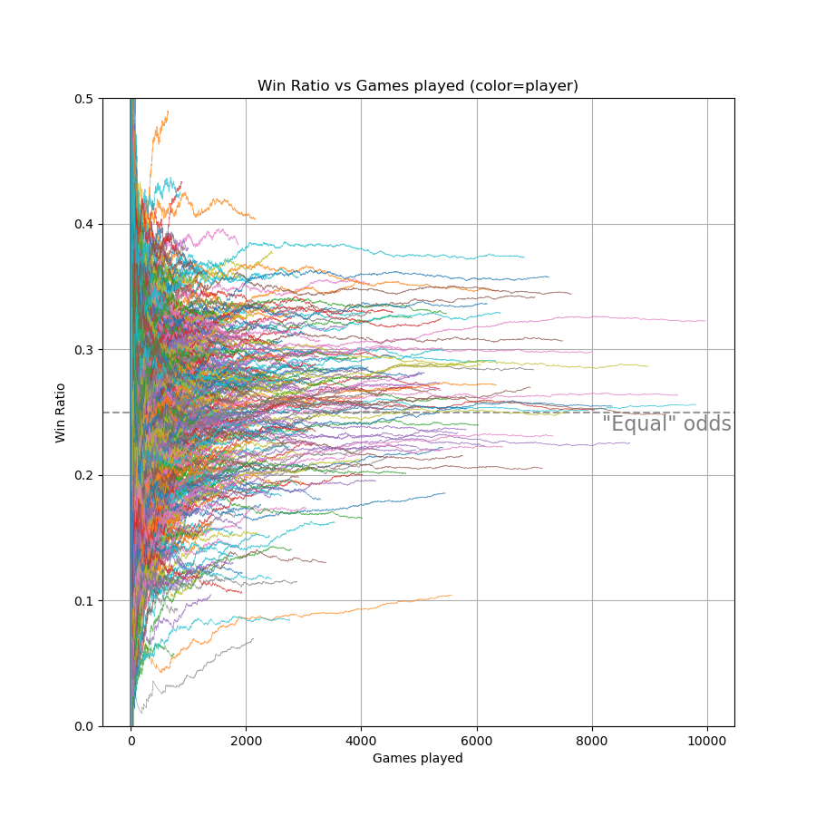
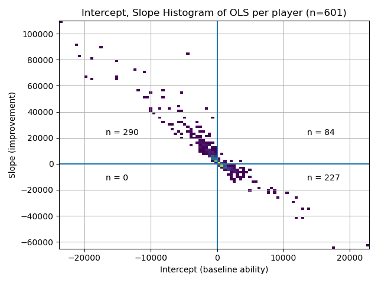

This is a project I did to better understand the differences in player performance playing Acquire on [the website](https://github.com/tlstyer/acquire). It's a terrible place for beginners, but there are a LOT of experts there, so this is the first in a series to try to divine from the game archives what I can about how to play better.

The biggest overall lesson from this analysis is that merely playing more games is demonstrated to not be enough to attain better skill. This analysis shows that, of the players who played more than 500 games, only about 84 of them started out decent and still managed to get better (the other 86 percent of them either started poor or got worse after a good start).

This figure shows the different players cumulative wins over relative time (games played). The slope of this line and the changes to it are the most pertinent facts to this analysis.

Since the slope of this line is the interesting part, we can look at that as a function of games played instead of simply games won. This works out to be the same as both the derivative of the above lines (ie, the slopes), but also the "win ratio" (victories/played-games) for each player.

 

Most people like to win, and most people stop playing if they are still performing poorly after 500 attempts at winning. If we run a plain linear regression on every unique player's history we can see this pattern play out, as well as more insights. When you run a linear regression, the main facts of the results are the intercept (baseline ability in our case) and the slope (the 'average' change in win ratio for a player). The 2D histogram below shows a players improvement (their change-in-win-ratio-per-game) versus their baseline ability (their success rate when they started).

This shows us several things:
 - Literally no one (bottom-left quadrant) started poorly and got worse (among those that played 500 games on the site)
 - Most players (top-left and bottomr-right) either started good or got better (but not both)
 - There seems to be a tradeoff between initial success and improvement over time
 - Only a small contingent of 84 players started out well and still managed to get better (those who split the above tradeoff the best)

What I decided to try next was to see if I could get a basic linear model to predict the winner of a game before it started. I had a one-in-four chance of being right, but sadly never could predict the winner with much higher accuracy than about 30%. I tried using three different models, XGBoost, Gaussian Naive Bayes, and K-Nearest Neighbors, all of which performed barely better than just random guessing.

There are MANY signals during the game that can tell you who is going to win, but the "gambler" in me wants to see if I can predict who will win based solely on who's playing, rather than the match play itself (this is also the only realistic way to create a proper gambling marketplace).

