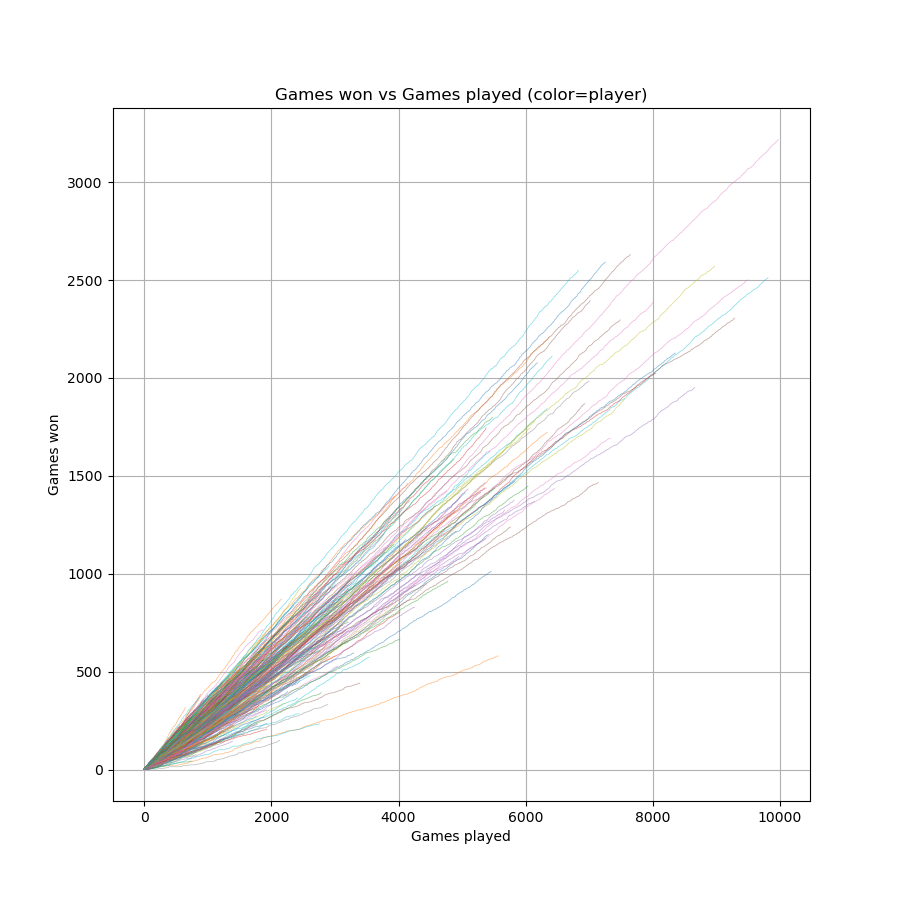

This is a project I did to better understand the differences in player performance playing Acquire on [the website](tlstyer/acquire). It's a terrible place for beginners, but there are a LOT of experts there, so this is the first in a series to try to divine from the game archives what I can about how to play better.

The biggest overall lesson from this analysis is that merely playing more games is demonstrated to not be enough to attain better skill. This analysis shows that, of the players who played more than 500 games, only about XXX of them started out decent and still managed to get better (the other XX percent of them either start poor or got worse after a good start).

This figure shows the different players cumulative wins over relative time (games played). The slope of this line and the changes to it are the most pertinent facts to this analysis.

Most people like to win, and most people stop playing if they are still performing poorly after 500 attempts at something. If we run a regression on every unique player's history we can see this pattern play out, as well as more insights. 
